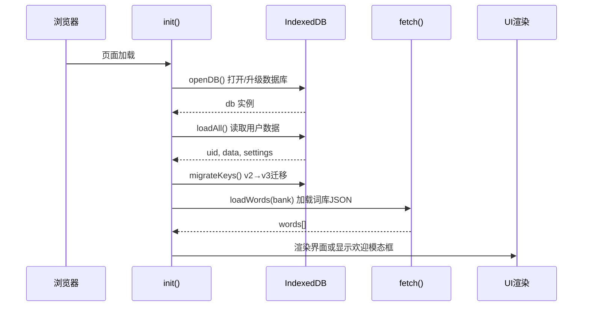
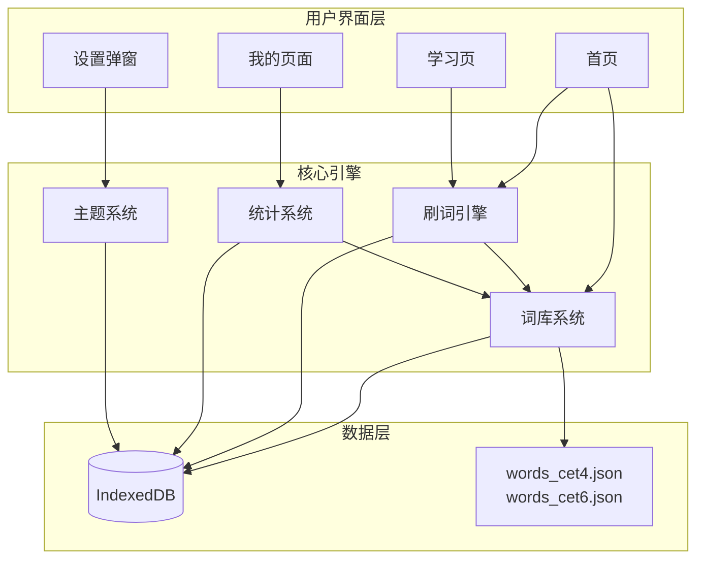
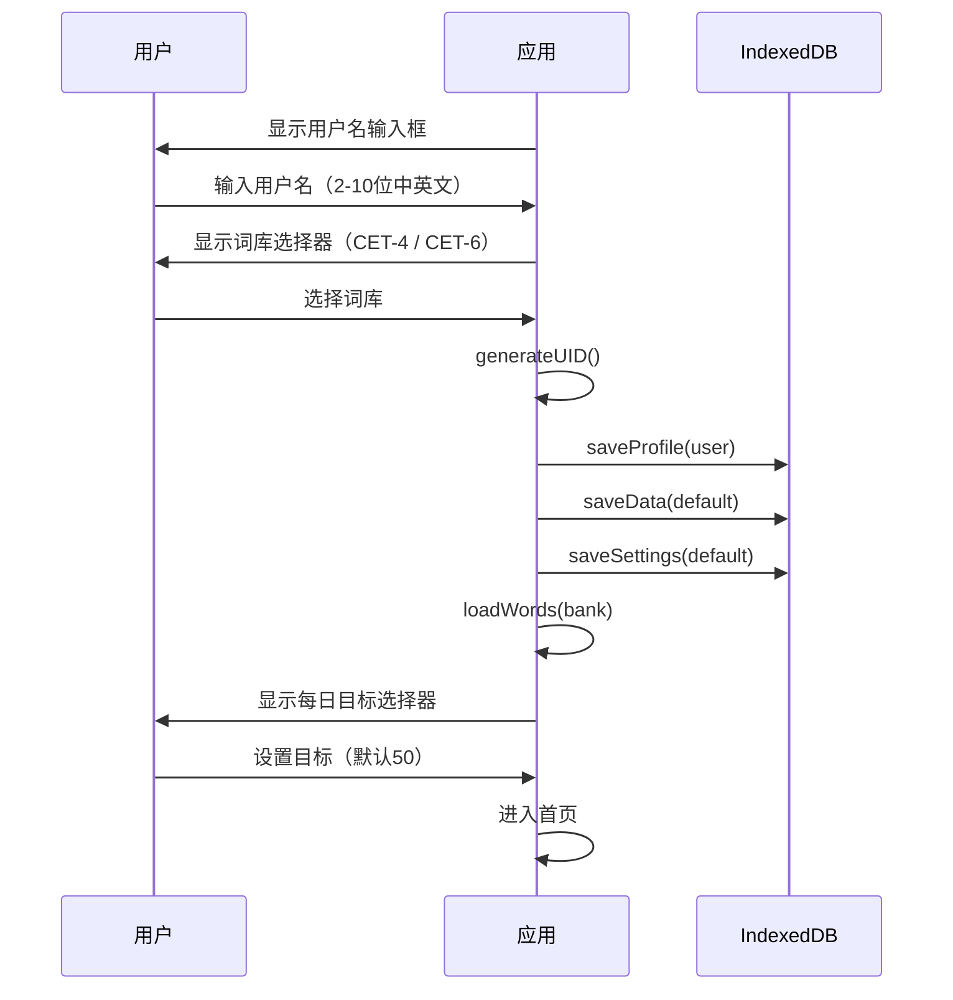

# 系统架构

## 概述

CET 词汇是一个纯前端 PWA 闪卡应用，支持 CET-4 和 CET-6 双词库。所有数据存储在浏览器 IndexedDB 中，无需后端服务。应用为单文件架构（`index.html`），约 1100 行代码，包含完整的 HTML / CSS / JavaScript。

用户可以按顺序或乱序刷词，收藏生词到生词本专项复习，查看打卡日历和统计进度。支持用户隔离（多用户共用同一浏览器时数据互不干扰）、多词库独立数据、以及 v1→v2→v3 自动迁移。

## 技术栈

**语言与运行时**
- Vanilla JavaScript (ES6+)
- HTML5 + CSS3 (CSS Variables)

**数据存储**
- IndexedDB (版本 3)，3 个 Object Store：`profile`、`data`、`settings`

**运行时环境**
- 浏览器（Chrome / Safari / Firefox / Edge）
- iOS Safari PWA 模式（支持 `safe-area-inset`、`apple-mobile-web-app-capable`）

**基础设施**
- 纯静态托管（GitHub Pages / Cloudflare Pages / Netlify 等任意静态服务器）
- `python3 -m http.server` 本地开发

**无外部依赖**
- 零 npm 包，零 CDN，零第三方库

## 项目结构

```
workspace/
├── index.html           # 完整 PWA 应用（HTML + CSS + JS IIFE）
├── words_cet4.json      # CET-4 词库（2607 词）
├── words_cet6.json      # CET-6 词库（548 词）
└── cet4_raw.json        # 原始数据源（Python 格式化，供参考）
```

**单文件内部逻辑划分**

```
index.html （约 1105 行）
├── <head>               # meta标签、CSP策略、主题预检测脚本、完整CSS
├── <body>               # DOM结构（模态框、三个Page、TabBar、按钮）
└── <script> (IIFE)
    ├── 常量与全局变量      # BANKS, currentBank, words[], 状态变量
    ├── 工具函数           # escapeHTML(), todayStr(), shuffleArr()
    ├── IndexedDB层       # openDB(), dbGet(), dbPut() (行 391-423)
    ├── 数据迁移           # migrateV1toV2(), migrateKeys() (行 427-461)
    ├── 数据存取           # loadAll(), saveData/Profile/Settings() (行 465-483)
    ├── 打卡系统           # checkNewDay(), onGoalMet() (行 486-508)
    ├── 词库加载           # loadWords(), showHomeWord() (行 511-537)
    ├── 刷词引擎           # startStudy(), nextWord(), prevWord() 等 (行 541-675)
    ├── 统计页面           # updateMyPage(), renderCalendar() 等 (行 678-757)
    ├── 设置系统           # 目标选择器、追踪模式、TTS (行 760-818)
    ├── 事件绑定           # 触摸/点击/键盘、手势阻止 (行 821-877)
    ├── 主题系统           # 深色/浅色切换与持久化 (行 884-893)
    ├── 词库选择器         # bankSelector, switchBank (行 989-1047)
    └── 初始化入口          # init() (行 1049-1093)
```

**入口点**
- `index.html` 第 1093 行：`init()` — 应用启动

## 子系统

### 数据持久化层 (IndexedDB)

**目的**: 所有用户数据在 IndexedDB 中的读写与迁移

**位置**: `index.html` 行 391-483

**关键函数**: `openDB()`, `dbGet(store,key)`, `dbPut(store,key,value)`, `generateUID()`, `migrateV1toV2()`, `migrateKeys()`, `loadAll()`, `saveData()`, `saveSettings()`, `saveProfile()`

**依赖**: IndexedDB API

**被依赖**: 所有业务模块

**数据库 Schema**:

| Object Store | Key 模式 | 示例值 | 说明 |
|---|---|---|---|
| `profile` | `user:{uid}` | `{username, uid, activeBank}` | 用户档案 |
| `profile` | `active` | `"uid_xxx"` | 当前活跃用户ID |
| `data` | `data:{uid}:{bank}` | `{today, todaySwiped, ...}` | 某用户某词库的学习数据 |
| `settings` | `settings:{uid}:{bank}` | `{trackMode, dailyGoal, ...}` | 某用户某词库的设置 |
| `settings` | `theme:{uid}` | `"dark"` 或 `"light"` | 主题偏好（全局） |

### 词库系统 (Bank System)

**目的**: 多词库管理与切换，词库间数据完全隔离

**位置**: `index.html` 行 375-376（BANKS 定义）、行 989-1047（选择器）、行 511-526（加载）

**关键数据**: `BANKS = {cet4: {name:'四级核心词汇', file:'words_cet4.json'}, cet6: {name:'六级核心词汇', file:'words_cet6.json'}}`

**依赖**: 数据持久化层（读/写 Data 和 Settings）

**被依赖**: 刷词引擎、统计模块

### 刷词引擎 (Study Engine)

**目的**: 三种模式（顺序/乱序/生词本）的单词循环展示与交互

**位置**: `index.html` 行 541-675

**关键函数**: `startStudy(mode)`, `nextWord()`, `prevWord()`, `showStudyWord()`, `currentStudyList()`, `speakWord()`, `toggleBookmark()`, `saveProgress()`

**依赖**: 词库系统（依赖 `words[]` 和 `bookmarkWords[]`）、数据持久化层（读/写进度）

**被依赖**: 事件系统（触摸/键盘触发）

**并发保护**: `nextWordBusy` 和 `prevWordBusy` 互斥锁，防止快速连续操作导致重复跳词

### 进度统计系统

**目的**: 打卡日历、连续天数、刷词轮数、生词本管理

**位置**: `index.html` 行 486-508（打卡逻辑）、行 678-757（统计页面）

**关键函数**: `checkNewDay()`, `onGoalMet()`, `updateMyPage()`, `renderCalendar()`, `renderBookmarkTags()`

**依赖**: 词库系统（读取 `data` 对象）

**被依赖**: 页面切换（`switchPage('my')`）、每日首次刷词（`nextWord()` 触发）

### 主题与设置系统

**目的**: 深色/浅色切换（跟随系统或手动）、每日目标、追踪模式、TTS 开关

**位置**: `index.html` 行 884-893（主题）、行 760-818（设置）、行 1049-1091（主题初始化）

**关键函数**: `saveTheme()`, `updateSettingsUI()`, `renderGoalPicker()`, `bindGoalPicker()`

**依赖**: 数据持久化层（读写 Settings）

**被依赖**: 全局（影响整个 UI 渲染）

## 架构图

### 数据流



### 系统模块依赖



### 新用户注册流程



### 主题检测决策

```mermaid
flowchart TD
    Load[页面加载] --> SyncHead["`<head>` 同步脚本检测<br/>prefers-color-scheme`"]
    SyncHead -->|dark| SetDark[添加 .dark class]
    SyncHead -->|light| NoAction[不添加 class]
    SetDark --> Init
    NoAction --> Init
    Init[init 执行] --> CheckPref{"`settings.theme<br/>有值？`"}
    CheckPref -->|有| Explicit["themeExplicitlySet = true<br/>按存储值设置"]
    CheckPref -->|无| LoadDB[读 IndexedDB theme:{uid}]
    LoadDB -->|有值| Explicit
    LoadDB -->|无值| FollowSystem["按系统偏好<br/>themeExplicitlySet = false"]
```

## 设计决策

### 单文件架构

整个应用打包为一个 HTML 文件，这是刻意选择的架构决策：零构建工具链、零运行时依赖、部署时只需上传一个文件。CSS 使用 CSS Variables 实现主题切换，JavaScript 使用 IIFE 隔离作用域。

### IndexedDB 选型

选择 IndexedDB 而非 localStorage 的原因：
- **容量**: IndexedDB 无严格大小限制（浏览器通常在总磁盘的百分比内）；localStorage 通常限制 5-10MB
- **数据结构**: 可以按 Object Store 组织键值对，比 localStorage 扁平键空间更清晰
- **迁移能力**: `onupgradeneeded` 事件可基于 `oldVersion` 做增量迁移

### 多词库隔离策略

每个词库使用独立的 IndexedDB Key：`data:{uid}:{bank}` 和 `settings:{uid}:{bank}`。切换词库时保存当前进度，加载新词库的独立数据。`activeBank` 字段持久化在用户 `profile` 中，保证刷新后回到上次选中的词库。

### XSS 防护策略

三管齐下：
1. **escapeHTML()**: 通过 DOM `textContent` trick 转义用户可控字符串，所有 HTML 注入点都经过此函数
2. **CSP meta 头**: `default-src 'self' 'unsafe-inline' 'unsafe-eval'; img-src data:; connect-src 'self'; media-src 'self' blob:`
3. **textContent 优先**: 非 HTML 内容默认使用 `textContent` 而非 `innerHTML`
