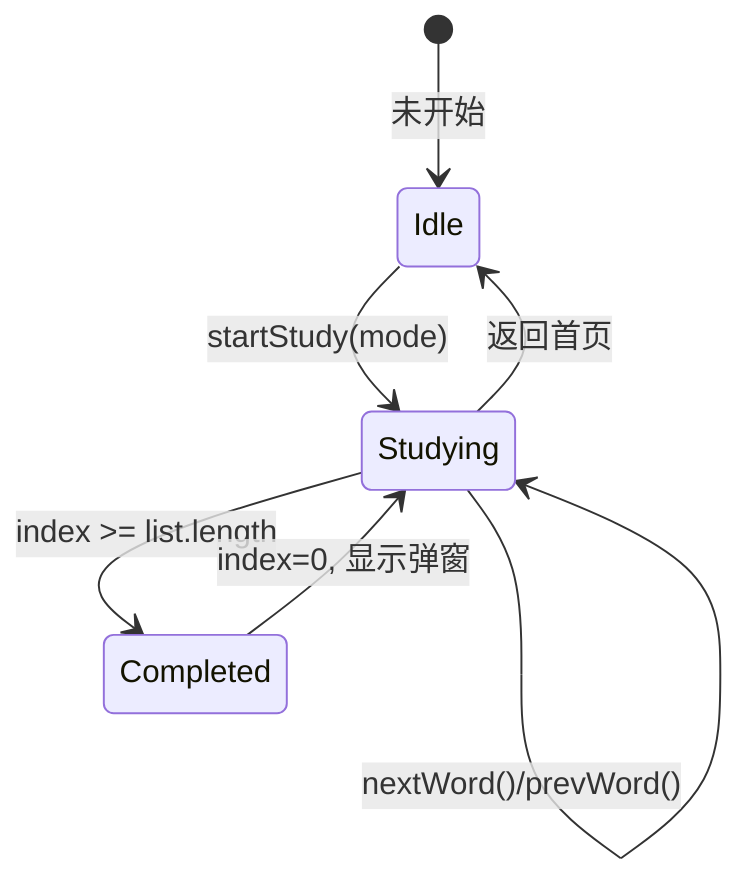

# 刷词引擎

刷词引擎是应用的核心子系统，负责三种刷词模式（顺序/乱序/生词本）下的单词循环展示、用户交互处理和进度保存。

## 什么是刷词引擎？

引擎维护一个单词列表的游标 `index`，响应用户的滑动/点击/键盘事件前进或后退游标，展示当前单词并朗读。完成一轮后显示完成弹窗并自动开始下一轮。

## 代码位置

| 方面 | 位置 |
|------|------|
| 启动刷词 | `index.html` 行 542-563 `startStudy()` |
| 下一词 | `index.html` 行 621-656 `nextWord()` |
| 上一词 | `index.html` 行 606-617 `prevWord()` |
| 展示单词 | `index.html` 行 571-579 `showStudyWord()` |
| 当前列表 | `index.html` 行 566-568 `currentStudyList()` |
| 朗读单词 | `index.html` 行 668-675 `speakWord()` |
| 保存进度 | `index.html` 行 660-665 `saveProgress()` |
| 生词管理 | `index.html` 行 591-599 `toggleBookmark()` |
| 收藏按钮状态 | `index.html` 行 582-589 `updateBookmarkBtn()` |
| 首页按钮 | `index.html` 行 822-823, 879-881(事件绑定) |

## 三种模式

| 模式 | 列表来源 | 进度 key | 统计累计 |
|------|---------|---------|---------|
| `order` | `ordered[]`（按字母排序） | `progress.orderIndex` | `data.orderSwiped` |
| `shuffle` | `shuffled[]`（每轮重新洗牌） | `progress.shuffleIndex` + `progress.shuffleOrder` | `data.shuffleSwiped` |
| `bookmark` | `bookmarkWords[]`（生词本单词对象） | `progress.bookmarkIndex` | 不累计 |

## 刷词流程



## 并发保护

两个独立互斥锁：

- `nextWordBusy`: 保护 `nextWord()`，防止快速连续右滑触发多次
- `prevWordBusy`: 保护 `prevWord()`，防止快速连续左滑触发多次

两把锁独立工作，用户快速左右交替滑动不会互相阻塞。

## 触摸交互规则

| 手势 | 条件 | 动作 |
|------|------|------|
| 点击 | 未滑动，<300ms，<15px 位移 | 左半屏 `prevWord()`，右半屏 `nextWord()` |
| 左滑 | dx < -30，\|dx\| > \|dy\| | `nextWord()` |
| 右滑 | dx > 30，\|dx\| > \|dy\|，起手 x > 15 | `prevWord()` |
| 上滑 | dy < -30，\|dy\| > \|dx\| | `toggleBookmark()` |

起手 x > 15px 的限制用于避开 iOS 左边缘返回手势区。

## 轮次完成

当 `index` 超过列表长度时触发：

1. 非生词本模式：`data.rounds++`，显示"完成一轮 xxx 刷词！累计完成 N 轮"
2. 生词本模式：显示"生词本刷完！共 N 个单词"
3. `index` 归零，`saveProgress()` + `saveData()`，展示新轮次首词
4. **不累加 `todaySwiped`**（避免新轮次首词被错误计数）

## 词索引 Map

`buildWordIndex()` 构建 `{wordName: wordObject}` 的索引 Map，使生词本查找从 O(n*m) 降为 O(1)：

```javascript
// 之前：嵌套循环
for (var i=0; i<bookmarks.length; i++)
    for (var j=0; j<words.length; j++)
        if (words[j].word === bookmarks[i]) ...

// 之后：O(1) 查找
wordIndex[bookmarks[i]]
```

## 朗读 (TTS)

`speakWord()` 使用 Web Speech API：

- 语言: `en-US`，语速: `0.85`
- 朗读前 `cancel()` 清除队列
- 受 `settings.ttsEnabled` 控制是否自动触发
