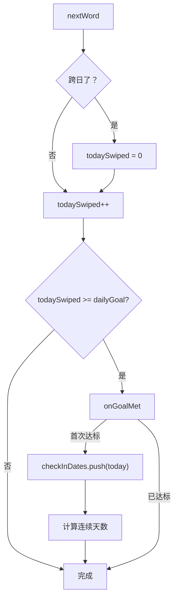

# 进度统计

进度统计系统追踪用户的每日打卡、连续天数、本轮进度和生词本状态，并在"我的"页面可视化展示。

## 什么是进度统计？

每刷一个词，系统累加 `todaySwiped`。当 `todaySwiped >= dailyGoal` 时，触发 `onGoalMet()` 记录当天打卡日期，更新连续打卡天数。

## 代码位置

| 方面 | 位置 |
|------|------|
| 每日重置 | `index.html` 行 486-492 `checkNewDay()` |
| 打卡记录 | `index.html` 行 494-508 `onGoalMet()` |
| 统计页面渲染 | `index.html` 行 692-714 `updateMyPage()` |
| 打卡日历 | `index.html` 行 716-732 `renderCalendar()` |
| 完整日历弹窗 | `index.html` 行 941-965 `renderFullCalendar()` |
| 生词本标签 | `index.html` 行 734-741 `renderBookmarkTags()` |
| 追踪模式辅助 | `index.html` 行 678-689 `getTrackedSwiped()`, `getTrackedRounds()` |

## 核心指标

| 指标 | 存储字段 | 展示位置 |
|------|---------|---------|
| 今日已刷 | `data.todaySwiped` | `#todayCount` |
| 今日剩余 | `dailyGoal - todaySwiped` | `#remainCount` |
| 累计轮数 | `data.rounds` 或按模式计算 | `#roundsCount` |
| 连续打卡 | `data.streakDays` | `#daysCount` |
| 本轮进度 | 当前 index / TOTAL | `#progressFill`, `#progressText` |
| 打卡日历 | `data.checkInDates[]` | `#calendar`, 完整月历弹窗 |
| 生词本数量 | `data.bookmarks.length` | `#bookmarkTags`, `#bookmarkCount` |

## 打卡逻辑



## 连续天数计算

从今天开始逐日回溯，直到遇到未打卡日期：

```javascript
var streak = 1, d = new Date(today);
while (true) {
    d.setDate(d.getDate() - 1);
    if (checkInDates.indexOf(d.toISOString().slice(0,10)) !== -1)
        streak++;
    else break;
}
data.streakDays = streak;
```

使用 `indexOf` 线性查找，`checkInDates` 保留最近 365 天（超过则 `shift()`）。

## 追踪模式

用户可选择只统计某模式或全部模式的刷词量：

| `trackMode` | 刷词计数 | 轮数 |
|-------------|---------|------|
| `both` | `data.totalSwiped` | `data.rounds` |
| `order` | `data.orderSwiped` | `floor(orderSwiped / TOTAL)` |
| `shuffle` | `data.shuffleSwiped` | `floor(shuffleSwiped / TOTAL)` |

## 打卡日历

日历显示最近 28 天（4 行 x 7 列），以当前周为起点向回推算。已打卡日期标注绿色圆点，今天标注蓝圈。点击日历标题弹出完整月历查看器，支持前后翻月。

## 生词本标签

"我的"页面底部显示最近 20 个收藏单词标签（超 20 个时末尾显示 `...`）。单词名通过 `escapeHTML()` 转义后渲染，通过 `wordIndex` Map 在启动生词本刷题时高效查找单词对象。
